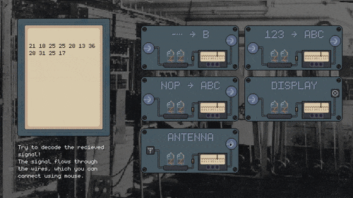

# wiretap
**A game where you connect modules to decipher the captured signal.**

[**Play on itch**](https://limit6.itch.io/wiretap)

Signal comes through your reciever, a string of unreadable encrypted text. By identifing the correct modules to use, dragging and dropping cables, you'll eventually manage to decipher the incoming signal.

This game takes place in a factory on the outskirts of Prague in the Protectorate of Bohemia and Moravia in 1944, where you have to _wiretap_ and decipher German war communications.

---

This game is made in the Godot engine and the sprites in aseprite.

### Credits
- Special thanks to my friend Peldik, who made the awesome soundtrack for this game. [Listen on Soundcloud](https://soundcloud.com/pelikanek/a-or-b)
- https://datagoblin.itch.io/monogram
- https://humblepixel.itch.io/pocket-inventory-series-2-pixel-map